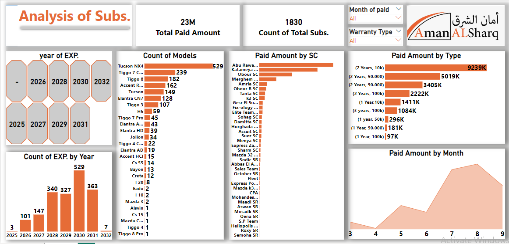

# 📊 Warranty Booklets Sales Analysis (Mar–Sep 2024)

This Power BI project analyzes the sales data of warranty booklets tracked in the **'Subscription'** sheet, covering the period from March to September 2024.

## ✨ Features
- Total number of booklets sold  
- Car types with warranty booklet sales  
- Sales locations and branch-wise performance  
- Monthly sales and revenue comparisons  
- Best-selling car models each month  
- Top-performing branches each month  

## 🎯 Goal
The goal of this analysis was to gain insights into sales performance, compare results across branches, and identify the best-selling models and locations to support better decision-making.
